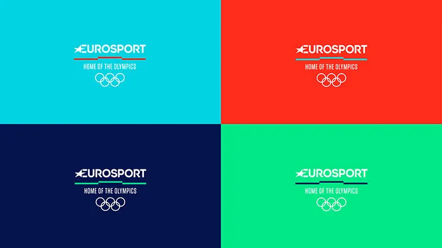

**Typography is an essential part of the sports viewing experience; inextricably linked to how well fans process and engage with any given sport.** From scoreboards to statistics, nailing the right typeface can add an elite, sleek and professional edge to a sports broadcaster's coverage. Behind fonts used by ESPN, Eurosport and Premier League Productions sits creative design agency DixonBaxi, founded in 2001 by long-time creatives Simon Dixi and Aprova Baxi.

