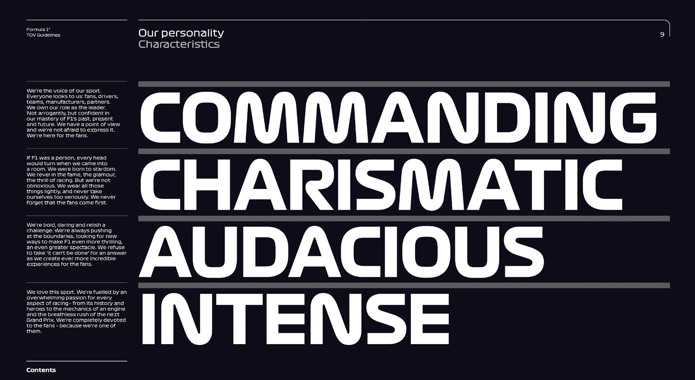
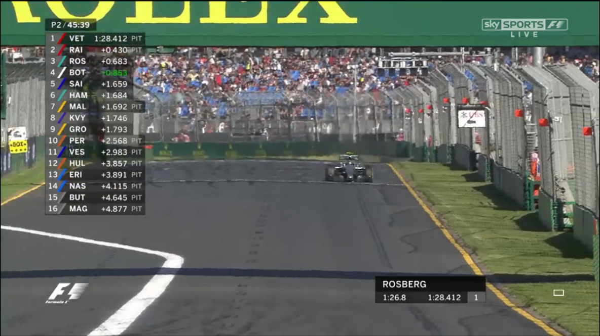
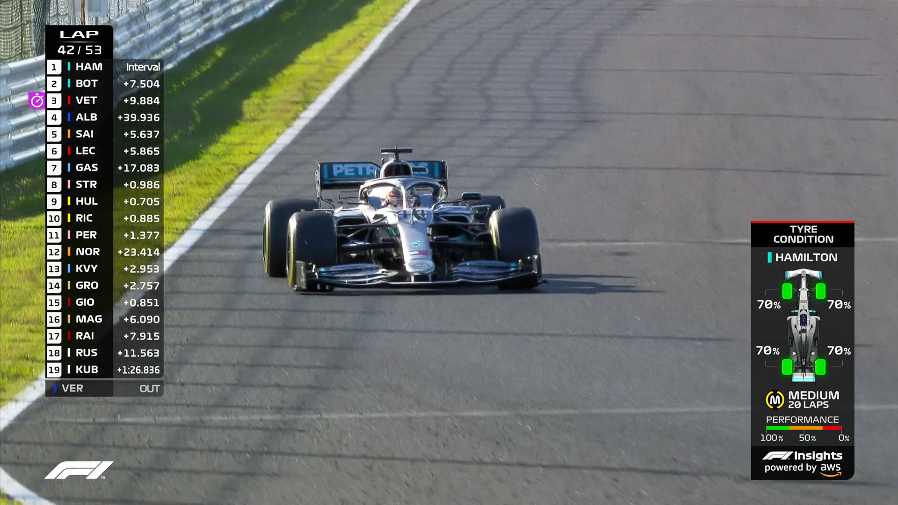

In January 2017, Liberty Media completed the purchase of Delta Topco, which, amongst other things, held the keys to the world’s elite motorsport series: Formula 1.

In wrenching the sport from the control of longtime boss Bernie Ecclestone, the American media holdings company, which also owns SirusXM and the Atlanta Braves MLB outfit, set out to put their own stamp on the sport, 

During the course of Liberty's rebranding effort (put together by Weiden+Kennedy), designed to make the broadcast experience more immersive, a new font - *Formula 1* - was commissioned for use across all of F1's broadcasting, social media profiles, trophies, website and live-event presentation. This bold, flowing and low-contrast font, complete with *Turbo* and *Torque* variations, has given Formula 1 a unique brand identity whilst maintaining the clarity neccesary to ensure viewers retain focus on the fastest-moving sport in the world.

This marked the most dramatic change to F1's on-screen presentation since 2004, where the iconic black/yellow screen bar was replaced with a white timing tower, with the new design completed after extensive research, including focus groups centered around maximising the principle of "engineered insanity" through F1's TV graphics. 

As part of the rebrand, F1 also gained a new logo, replacing a design that had been in use since 1994. Whilst this recieved initial backlash, as a part of the greater brand identity this design has been accepted by the majority of fans, and - as it possesses more mass market capitalisation appeal as part of the newer, more streamlined package - has been instrumental in bringing in new fans, many of whom have only known the sport in the Liberty era through the Netflix show *Drive to Survive*.

 and 2018-Present (bottom)")