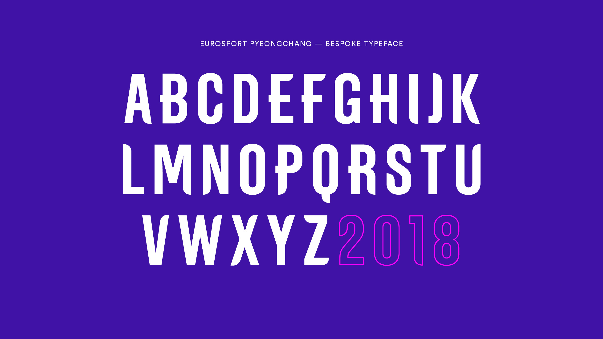
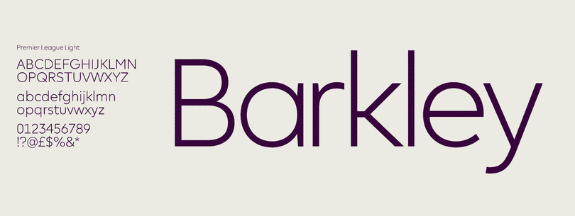
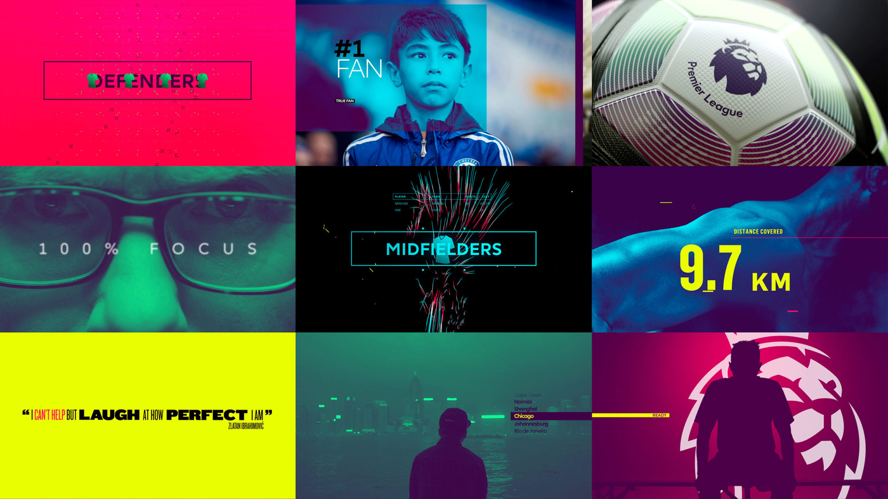

**Typography is an essential part of the sports viewing experience; inextricably linked to how well fans process and engage with any given sport.** From scoreboards to statistics, nailing the right typeface can add an elite, sleek and professional edge to a sports broadcaster's coverage. Behind fonts used by ESPN, Eurosport and Premier League Productions sits creative design agency DixonBaxi, founded in 2001 by long-time creatives Simon Dixi and Aprova Baxi.

Across a variety of sports, the duo and their London-based team have developed a range of typefaces for many broadcasters and special events, including the Premier League, ESPN and the Winter Olympics on Eurosport. Specifically, when designing the 2018 Winter Olympics broadcast font, agency creative lead Harry Ead noted "The attitude that the typeface gave us became the foundation for the design system. It’s been said a many times before, but if you covered the Eurosport logo on any of the applications you would still know it’s them and the custom typeface played a considerable part in that instant recognition."

That typeface was Eurosport PyongChang, custom-made for the games. With offshooting serif's on selected letters and no contrast, this sophisticated yet bold, impactful font demonstrates the eliteness of the games whilst not altering the viewing experience or making Eurosport's branding unintelligible. It was necessary for the typeface to be as understandable as possible, as over 330 million viewers accessed Eurosport's Olympic content across digital platforms and terrestrial television during the course of the games.

In addition to the iconic Olympic brand, DixonBaxi were also handed the mammoth task of redesigning the world feed graphics, typeface, music and titles for the Premier League. Seen by over 2 billion people, the clean, modern and streamlined interface is utilised across all Premier League Production (the IMG-operated company contracted to produce feeds for all EPL matches, alongside a range of studio and magazine programmes) shows, as well as in the league’s social media output.

In association with DesignStudio and Monotype, the font “Premier League” was created, utilising sans-serif, zero-contrast, clear yet stylish lettering to strike what Monotype labelled a “more conversational tone”. A unique element of a new EPL typeface is that it would need to be a true “workhorse”, for use across print, mobile, broadcast, in-stadium-screens, social media and even in games such as the Fifa series.

In 2017, this rebrand was nominated for The Beazley Designs of the Year award, and displayed in Kensington’s Design Museum.

