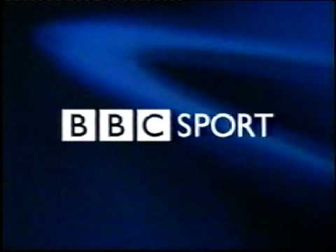
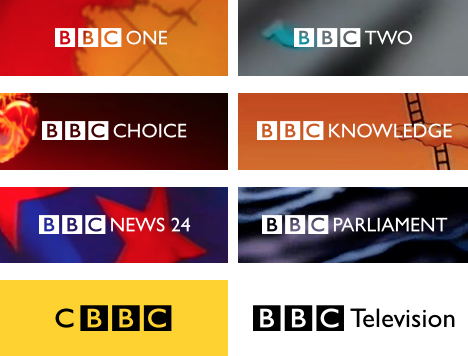

**As the nation's broadcaster, the BBC has been a key purveyor of sports coverage since its inception in 1936.** 

By June 1937, BBC Television broadcast the All England Tennis Championships (Wimbledon) for the first time, marking the first sport broadcast made on UK TV. A year later, the FA Cup was brought to the small screen, which, excluding the closure of BBC TV during World War II, has been broadcast ever since.

Live broadcasts first became a feature in 1954 with the World Cup beamed in from the Wankdorfstadion in Switzerland, with staple Match of the Day first entering screens in 1964.

The BBC continued to broadcast sport across its new channels without any form of centralised branding or typography until 1988, when the first BBC Sport visual identity was introduced. Prior to this, individual shows had used their own branding, such as Grandstand and Sportsnight, but without any central, core identity. 

The new ident coincided with the formation of the BBC's Sport unit itself, as, prior to the late-80's, sports had been controlled by individual channel controllers (including David Attenborough, who, as controller of BBC 2, founded the Floodlit Rugby League TV Trophy in 1965. It ran until 1980).

This featured the slanted BBC logo, combined with an italicised, zero-contrast capitalised sans-serif typeface. Whilst the globe animation was adapted in 1992, the slanted typeface remained until 1996.

## 1996-97

With a major rebranding on the horizon, the font was uprighted and made bolder for a graphics refresh in 1996. 

The sans-serif nature of the font remained, however the colour was changed to contrast against the grey of the then-BBC logo.

## 1997-2003

By 1997, the broadcaster had consolidated its branding across all radio and TV stations, adopting (with limited exception) Gill Sans across its output (seen below). Gill Sans, created by the sculptor Eric Gill, has also been used on British Railways since 1949, Penguin Books for paperbacks published after 1935, the logos of Tommy Hilfiger, Rolls Royce and Tag Heuer. Interestingly, it was used in Formula 1 as the logo of Benneton prior to their 2002 sale to Renault.

Commenting on the use of a well known, longstanding font (once labelled the 'Helvetica of England'), then Design Chief Martin Lambie-Nairn noted "by choosing a typeface that has stood the test of time, we avoid the trap of going down a modish route that might look outdated in several years' time."

This shift to Gill Sans, a zero-contrast, non-italicised, clean and (overwhelmingly corporate) sans-serif font. Gill Sans was used until 2017 across the BBC, and was fully removed in October 2021 to be replaced by the in-house BBC Reith font, which is now used in the BBC's logo.

## 2017-2021

In August 2017 BBC Sport switched from Gill Sans to BBC Reith across its website and broadcast outputs. This also included the new font affecting the logo, which was now set on a darker background in order to optimise it for digital/social media output.

## 2022 -

From 2022, all of the BBC's output will rebrand to further its drive for "modernisation". For BBC Sport, this means that for the first time, yellow will become the sole brand colour (with black phased out of the logo), and that a more sophisticated graphics overhaul is to be expected in the new year.

