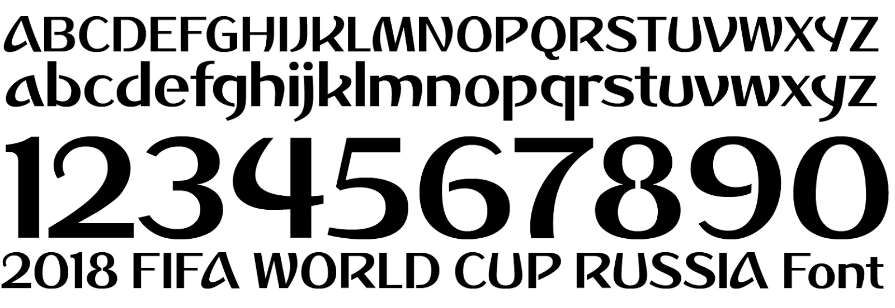
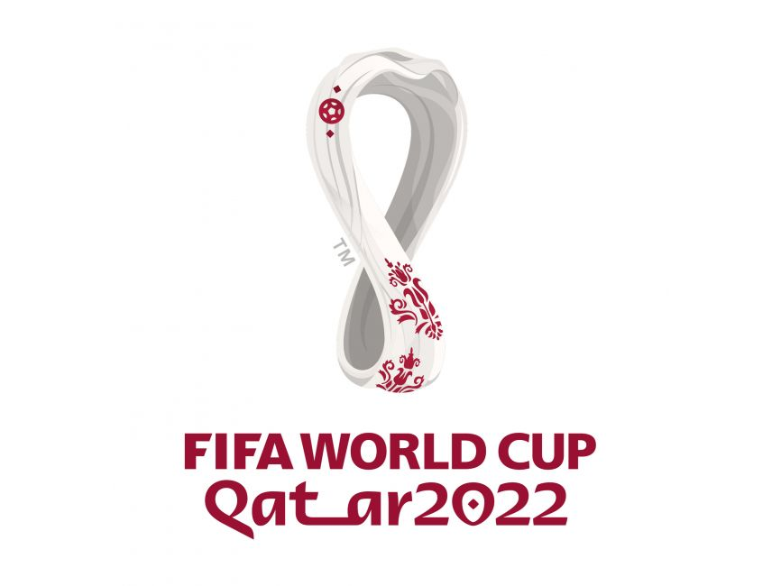

Held every four years, the FIFA World Cup is the most prestigious and sought after trophy in all of world sport, and its branding often becomes some of the most recognisable in the world both during and after the completion of the 48 team tournament.

Since 2006, each World Cup brand pack has come complete with its own typeface as part of its broadcast graphics and overall brand packaging. In the last 15 years, these have come to be symbolic of both the tournament itself, its prestige and the cultural background of the tournament's host nation.

## 2006 - Welcome

For the first time, the 2006 World Cup came with its own font, Welcome, produced by FIFA specifically for the event. The sans-serif, zero contrast curved and thin typeface remains of its time, with a variety of squared and pointed edges varying letter to letter.

This was the first time a united, all-encompassing tournament typeface had been implemented, and began a tradition that continues to this day. The 'welcome' font proved most apt for Italy, who left with the World Cup after defeating France in an infamous final.

## Font at a glance - Welcome

**Welcome is a font that stands out amongst its World Cup peers, being unique for the pointed finial affixed to the flag. Whilst on other number “5’s”, the flag remains sans-serif, the Welcome font uses an upward**

**Furthermore, the capital B lacks an inner lobe, with the middle cross-stroke connecting at both sides, unlike Dusha (2018).**

**The upper-case ‘N’ also utilises two tails with decorative, pointed terminals. The fact the upper-case variation of the font is stylised in the same way as the lower-case version is unique amongst the analysed fonts and indeed typefaces in general.**

**Unlike the two following fonts, Welcome lacks the hand-crafted cultural flair or feel, instead utilising traditional legs on the upper-case ‘K’ , as well as traditonally angled vertexes, seen in the “V” - whilst the “W” utilises curved vertexes.**

## 2010 - Menyaka

In the first font to feature cultural elements of the nation hosting the World Cup, the tournament's first visit to Africa featured a typeface curated by South African Jan Erasmus (who also designed the Nando's logo). 

Menyaka, the title of the font, is taken from the native Bantu language of Sesotho, which is one of 11 official languages in South Africa, and the only official language of Lesotho, the enclave nation encased entirely in South Africa; there are around five million active speakers of the language today. 

The font itself represents cultural elements of the African continent, through the use of angles most obvious in the letter "D" - and indeed in any letter that would traditionally have a straight, vertical element. The use of non-aligned angles adds a hand-crafted element to the font that had the effect of de-corporatising one of the biggest commercial events on the planet, and, as font creator Erasmus noted "a custom font guarantees brand distinction," something critical when the brand is as valuable as the FIFA World Cup. 

Featuring cultural elements is vitally important for this typeface; this was the first and to date only time the World Cup has been held in Africa, and put the continent on a global platform to show itself to the world. One of the most iconic tournaments in modern football, the opening goal, a thunderous strike from an unknown Siphiwe Tshabalala prompted accurate and iconic commentary from Peter Drury: "goal for South Africa; goal for all Africa."

Combined with the vibrant orange and green colours used in broadcast throughout the event, the Menyaka font remains one of my personal favourites, and is reminiscent for all of a breakthrough moment for African sport on a global stage.

Erasmus' past work was rooted in postmodernist and specialist typography, mainly focused on pixel-based fonts and typefaces with resemblances to the uncanny. This approach and background helped in designing brand elements for the first tournament played fully in the digital age, with the appearance and legibility of a font on screen more important than ever in ensuring it was both recognisable and popular amongst its audience - which, for an event as large as a World Cup, is as big as it gets. 

Spain finished as winners of the World Cup, but the heroics of Ghana, who reached the quarter finals, stole the show, despite the antics of Luis Suarez.

## Font at a glance - Menyaka

**Menyaka possesses a number of qualities that make it unique amongst the other World Cup fonts.** 

**Firstly, despite its hand-drawn effect, there is little use of swashes, as seen more evidently in Pagode (2014).** 

**Notably, this font does not use ears (the stroke extending from the top right hand side of a lower case “g,” or the vertical stroke from the top left hand side of a lower case “r”. This is in comparison to Dusha (2018), which utilises ears in its lower-case field.**

**There is a distinct lack of contrast utilised in the Menyaka typeface, despite its hand-drawn look and slight slant on some lower-case letters, such as “l” and the spine element of the lower case “f”.**

## 2014 - Pagode (Bold)

The World Cup Logo takes its current form as a consistently branded representation of the Coupe de Monde trophy, and, on this occasion, accompanied by a font representing the nation that won its predecessor, the Jules Rimet trophy, outright. For the 2014 World Cup, Pagode, a thick, sans-serif font complete with handwritten/artistic elements was used throughout broadcasts. 

The typeface was unveiled alongside the full brand, designed by Brazilian agency *Africa*, who noted the accompanying logo was based on "a photograph of three victorious hands together raising the World Cup trophy and its yellow and green colouring is meant to represent Brazil warmly welcoming the world to their country."

## Font at a glance - Pagode

**Contrast is used heavily in Pagode, as opposed to other World Cup fonts. Within the lower-case field, this is most apparent in the letter “c”, with the terminals significantly thinner than the centre portion of the letter.** 

**There is also a lack of symmetry in the lower case “c”, as, drawing a downward straight line at the top of the open counter, the bottom does not match.**

**Throughout the upper-case field, a range of letters are slanted altogether. This includes “M”, “N”, “Y”, “R” and “P”.**

**The hairlines in both the upper and lower-case ‘X/x” are matched inconsistently/asymetrically, a reminder of the font’s appeal as hand-crafted. This is also evident in the arch of the lower-case ‘h,’ which is also drawn in a hand-crafted style.**

## 2018 - Dusha

Where Erasmus utilised angles, the creators of Dusha, the flagship font of the 2018 World Cup, have utilised curves and contrast to hone in on Russia as the hosts of the most recent World Cup. 

Notably, every letter - capital or not - can be written in one motion, including "A", which has been stylised into a non-finished triangle. Stylistically, connection points at the lower- interior of capital letters do not connect - most recognisable in the "R" and "P" digits. In the lower case letters, this is occasionally reversed, with the connections at the upper interior not fully formed, again evident in the "b" and "d" digits. 

Noah Media Group, who designed the Russia World Cup branding and graphics, said they took cues from Russian imagery in a bid to reference and celebrate the host country, including the themes of "magic and dreams", and hitting on Russian events of historical significance, such as the Space Race, which Noah says their graphics "reference the same style as the opening title, using the official brand colours, patterns and typefaces."

BrandiaCentral - the Portugese agency responsible for the World Cup logo - added "all of the research corroborated the idea that Russia is the land of magic. A centuries-old culture, a fairytale-like architecture, the soul of its people, known by its determination and by the achievements that follow. Visually, we can find several inspirations from this background."

## Font at a glance - Dusha

**Across a selection of the letters, there is a lack of bowls, with a variety of traditonally closed portions being left stylistically open, notably in the capitals ‘D’, ‘P’, and ‘R’.** 

**Within the ‘A’, a stroke is not used, instead, what would normally constitute the stroke is drawn diagonally from the baseline across the central portion of the letter. This is not done in any other of the World Cup fonts.** 

**Furthermore, within the interior of the capital ‘V’, a diagonal stroke leading to an acute crotch, which is more open than in a traditonal capital V.  This is because the diagonal stroke on the right hand side of the letter has been ‘subbed’ in favour of a curved arm, leading to a finial.**

## 2022 - Qat_ar

We're one year away from Qatar 2022, and a World Cup already marred by the deaths of countless construction workers in the process of building a plethora of brand new stadiums.

The 2022 typeface presented a unique challenge. As the first World Cup to be held in the middle east, both Arabic and Latin typefaces would need to be developed and used in synergy. 

The agency Unlock Brands combined Arabic calligraphy, which "lent a singular flow and personality, with the Kasheeda element - a linear extension of specific Arabic letters - assuming itself as a striking brand identity element" and traditional Latin typefaces to create a consistent font for a consistent, modern brand.\
\
The result, say the agency, "is a new, contemporary font, inspired by the region, fusing tradition with modernity."

It remains to be seen who will leave the middle east with the trophy in tow, but one thing is for sure, the business of World Cup fonts looks set to be a tradition that will continue long into the future, across all platforms, mediums and in every nation around the world.

## Font at a glance - Qatar 2022

**The Qatar 2022 font has been designed with clean corportate production at its heart. Later in this edition, there’s an article on why Sports has only two type of font - this is a carbon cutout of the “slick and dull”,” type two variation.**

**That isn’t to say this typeface is compleley devoid of imagination; the use of a diamond-shaped diacritic on the lower case “i” and “j” (the later of which also utilises a triangular ligature at the descender line).**  

**Furthermore, the bowl is stylised within the number “9,” with the use of a pointed edge on the apeture section. Overall, the font lacks the character of its predecessors - but, when your football culture is corruption, slave labour and underhand dealings, maybe it’s best it didn’t shine through in the font?**