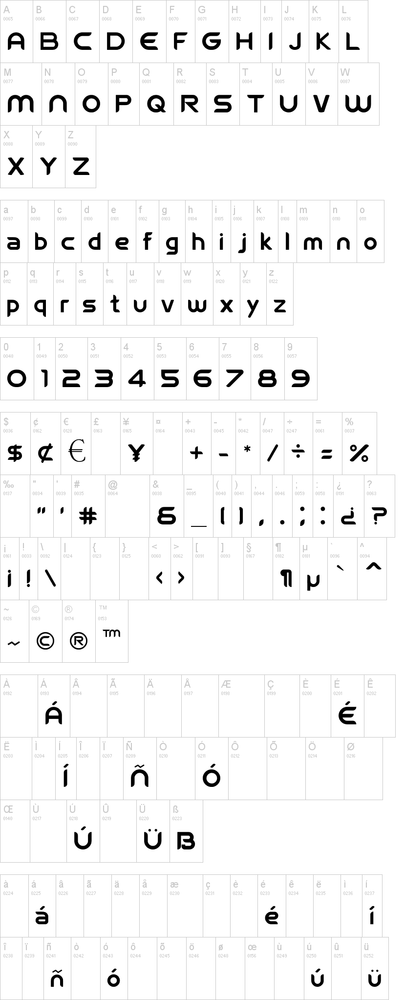

Held every four years, the FIFA World Cup is the most prestigious and sought after trophy in all of world sport, and its branding often becomes some of the most recognisable in the world both during and after the completion of the 48 team tournament.

## 2006 - Welcome

For the first time, the 2006 World Cup came with its own font, Welcome, produced by FIFA specifically for the event. The sans-serif, zero contrast typeface remains of its time, with a variety of squared and pointed edges varying letter to letter. 

## 2010 - Menyaka

In the first font to feature cultural elements of the nation hosting the World Cup, the tournament's first visit to Africa featured a typeface curated by South African Jan Erasmus (who also designed the Nando's logo). Menyaka, the title of the font, is taken from the native Bantu language of Sesotho, which is one of 11 official languages in South Africa, and the only official language of Lesotho, the enclave nation encased entirely in South Africa; there are around five million active speakers of the language today. 

Erasmus' penchant for culturally African font began in 2007, when he released 

## 2014 - Pagode (Bold)

