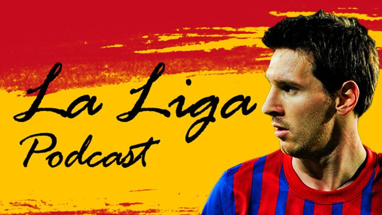

When I was growing up, I had a theory. I had no proof of this theory, or any real idea of how to convey it - or even if it was grounded in reality at all. It was the sort of theory that was so completely pointless that very few people would even bother to wonder how I got there.

But here goes.

Sports teams, broadcasters and, well, sport agencies have really only got two types of font. 

1 - Wild and out there, flashy and bold.

2 - Corporate, clean, understated, consistent.

For years, we have flipped between the two, brands never quite settling on which is better. 

Don't believe me?

Growing up in a house with a Sky Sports subscription (when it had everything) meant from a young age, I was transfixed by Spanish football. Sky held the rights to La Liga for over two decades, before upstart streaming platform Eleven Sports outbid them in 2019. 

There are three things I remember from those broadcasts: the spellbinding brilliance of Lionel Messi and Cristiano Ronaldo, the signature jingle... and the font.

Here was their effort at "wild and out there". It may be a font-thing, but the bold, sans-serif, translucent, print-pressed nature of the typeface is shared with legendary video game Fifa Street. Sky also made use of a classical, classy cursive font, not dissimilar to something you'd see on the menu of a Tapas bar, perhaps.

And, when Sky Sports repackaged their offering in 2017, here's what we got instead - cold, corportate and consistent.

Sky's centralisation and consolidation of branding in 2017 killed the idea of unique typefaces for unique products, with all traces of La Liga's gold and red (Spanish flag inspired) colour scheme replaced by red nothingness.

But what about