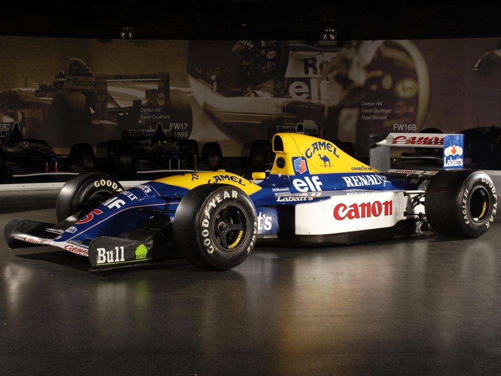
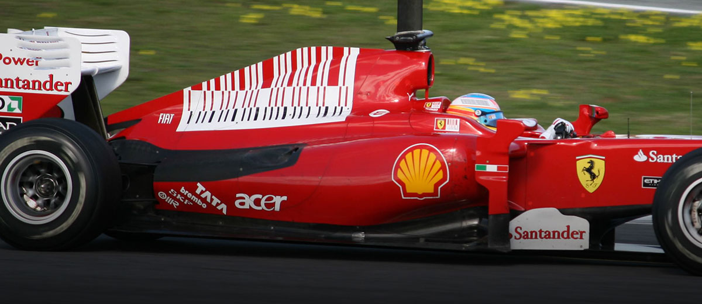
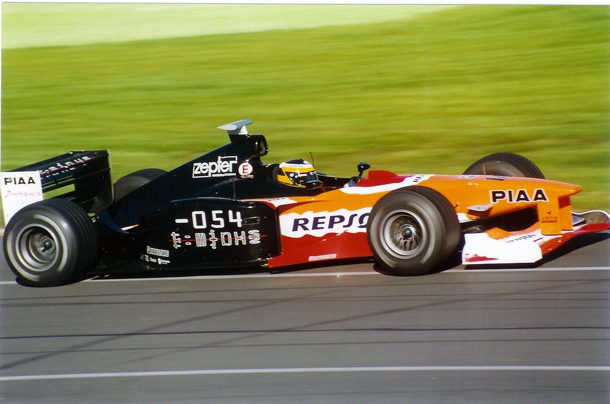
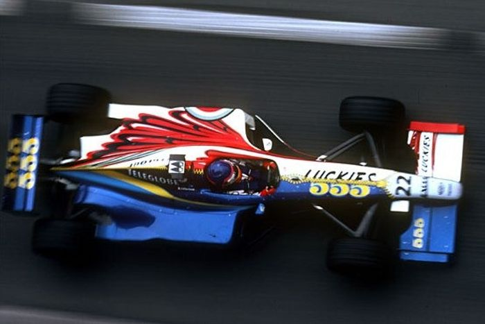
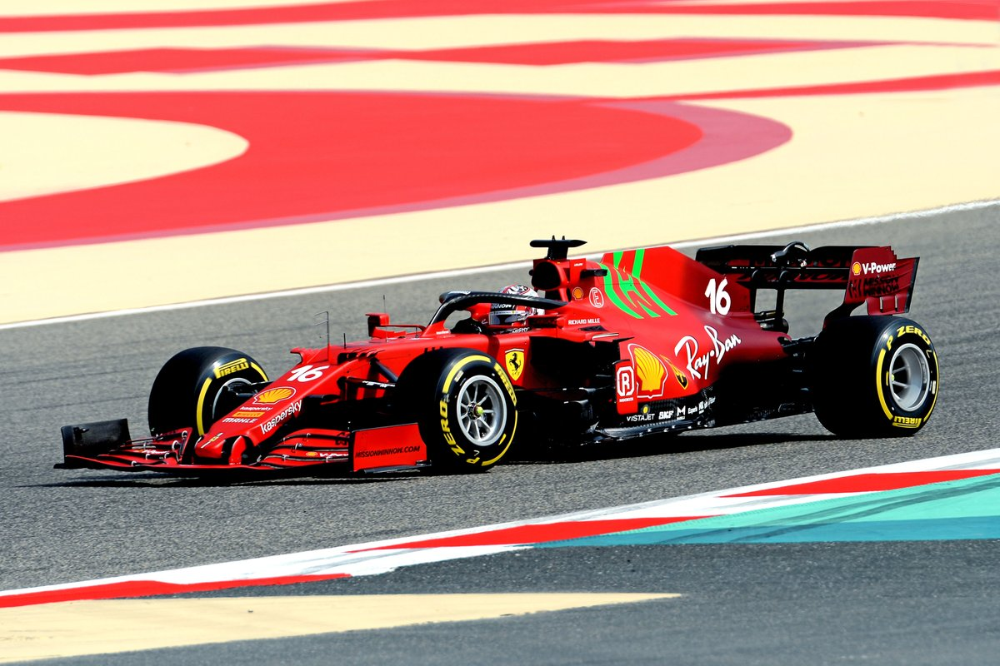

For anyone with an interest in Formula 1 cars, liveries - and by proxy the companies that sponsor them - have become iconic in their own right. No memory of Ferrari’s domination from 2000-2004 would be complete without association to cigarette company Malboro, who switched to sponsoring the ‘prancing horse’ from the equally iconic Red and White McLaren cars driven by Prost, Senna, Hakkinen and more.

Equally, poor or awkward branding on an F1 car can make a car visually unappealing, or worse, actively ugly. Whilst the ultimate objective of a Formula 1 car is to go fast, its aesthetic appeal can seriously determine its popularity with fans and sponsors alike. 

In its illustrious 71-year history, F1 teams have produced a plethora of weird, wacky and wonderful liveries, complete with unique typefaces - or, in some cases, non-fonts.

Honourable mention - Red Bull's liveries:

**Since joining the F1 circus in 2005, Red Bull Racing have established themselves as one of the most innovative, forward-thinking and resourceful teams on the grid. Known for their domination in the first half of the 2010’s, as well as lighting pit stops and unique marketing stunts (such as having a car navigate a ski resort slope), it is surprising that their designers have barely touched up the livery of the iconic Austrian-drink fuelled car.** 

**Whilst the stroke of the sans-serif logo font has changed from white to blue - and the blue has been altered to a matte, not gloss, finish, a the 2021 Red Bull would not look out of place alongside the 2015 Red Bull. Whilst most constructers modify their livery each year, and make major changes every 4-5 years to freshen up the team’s identity, Red Bull’s timeless colour scheme and clean typeface makes this unneccessary - at least in their eyes.** 

## The Good - Williams 1985-1994

Williams is an iconic name in F1, mainly thanks to the work of the late Sir Frank Williams and technical expert Patrick Head. Between them, Williams won 9 constructors titles and 7 drivers championships, forming notable partnerships with motor racing legends such as Nigel Mansell, Nelson Piquet, Damon Hill, Jacques Villeneuve and - for just three races - Ayrton Senna.

The 1992 car, adorning the same colour scheme as the cars from the last seven seasons, was complete with iconic sponsors, most notably Canon. The use of ears on the lower-case ‘n’s’ and the prominent placement on the sidepods.

Furthermore, the diagional counter within the ‘o’ in the Canon logo mirrors a tilted camera lens, an interesting typographical feature potentially only pertinent when the car is stationary. 

## The Cheeky - Ferrari 2008-11

Another team synonymous with using one colour scheme is Ferrari, who, once cigarette advertising prevented Malboro branding being added to the car in 2008, used a sneaky barcode to show Malboro colours - and, when the car was at high speed, the barcode blended to resemble the logo itself. Used from 2008-2010, the barcode was an iconic, and controversial, piece of (in some form) typography.

## The Bad - Arrows (1999)

When t-minus joined the F1 grid as sponsors of the struggling Arrows team, eyebrows were raised at just how much the brand had paid for their prime placement on the sidepod of the backmarkers’ car. $125 million was promised to Tom Walkinshaw’s outfit - except the money wasn’t real, and the owner of t-minus was Nigerian ‘Prince’ Malik Ado Ibrahim. For over half of the season, the t-minus brand appeared throughout F1, with little explanation as to what it actually was or how the company generated any income. 

Eventually, Prince Malik explained that t-minus was an energy drink, before changing his tune to claim it was simply a brand that could be applied in sticker form to a variety of luxury products - naming Lamborghini and Ducatti as businesses he had struck deals with.

Both Lamborghini and Ducatti knew nothing about it.

The car itself was a mess of sponsors and colours, painted orange as part of its agreement with the mobile service company of the same name. As for t-minus’ typography, the low profile, compact typewriter-style font was both unremarkable and somehow ten years out of date (despite being produced in 2000).

Prince Malik left F1, having coughed up none of the promised $125 million, and was later investigated by American authorities after perpetrating a similar swindle in the NASCAR series.

## The Ugly - BAR (1999)

After discovering that they could not run cars with seperare liveries, British American Racing - the offshoot F1 team created by British American Tobacco, simply split their 1999 ar in-half, with the right-hand side adorned with 555 branding, and the left with the Lucky Strike typography.

Incredibly, one of F1’s ugliest cars was also involved in two of its biggest crashes. When drivers Jacques Villeneuve and Ricardo Zonta ventured to Spa-Francorchamps, both made a pact to take the fearsome Eau Rouge corner without lifting from the throttle.

On Villeneuve’s first qualifying run, he lost control at the top of Eau Rouge, careering into the barrier and rolling the car (pictured below). Not to be outdone, Zonta (pictured left) lost control of his twin-liveried car, careering into a tyre wall at 170mph, before his car was spat across the track into the gravel. The damage to the cars cost £4.5 million, but both drivers only suffered bruised egos.

<iframe width="560" height="315" src="https://www.youtube.com/embed/wGZFio88QYA?rel=0" allow="accelerometer; autoplay; encrypted-media; gyroscope; picture-in-picture" allowfullscreen></iframe>

## The Stupid - Ferrari's SF21

How could it be possible that F1’s most legendary team could produce arguably its most visually stomach-turning car? Complete with a childlike, completley unfit typeface, the SF21 - which added burgandy and green to the relatively straightforward Ferrari colour palette - is easily the ugliet car on the grid in 2021, and possibly an all-timer for poor, misfit fonts.

The horror show on the front of the car caught the eye of experts and fans alike, with F1 technical reporter Craig Scarborough likening the typography to “paintwork with a two-inch brush,” and another replying to a photo of the typeface with “this car is a disgrace to Ferrari.” 

The font’s rough terminal edges, lack of sharp sides and serated flag on the 5’s of Carlos Sainz’s car mean the font - which would look more at home in a comic book - simply looks out of place. F1 is meant to ‘look’ fast, whilst the over-sophistication of a numeral-only typeface have made Ferrari’s green and red monstrosity the laughing stock of the F1 paddock.